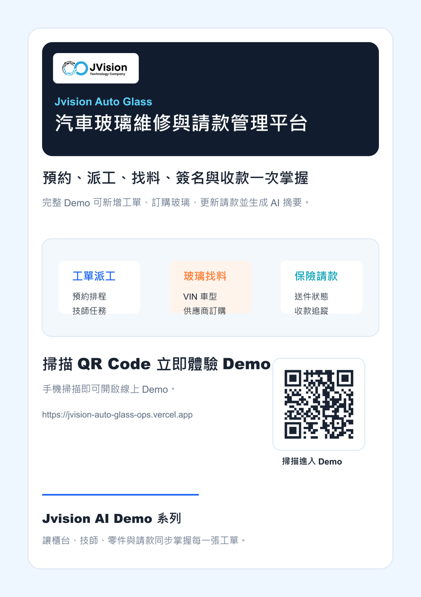

# Jvision 汽車玻璃維修與請款管理平台

可互動展示的汽車玻璃店務 Demo，整合預約工單、技師派工、玻璃訂購、客戶簽名、保險請款、收款追蹤與 AI 店務摘要。

## 線上 Demo

https://jvision-auto-glass-ops.vercel.app

## 專案海報

[](docs/marketing/jvision-auto-glass-ops-poster.png)

## Demo 功能

- 新增汽車玻璃維修工單
- 送出玻璃訂購與追蹤到貨
- 依流程推進工單狀態
- 更新保險請款與收款狀態
- 生成 AI 店務與請款摘要

## 指令

```bash
npm install
npm run build
npm run assets
npm run verify
```

## 行銷素材

- `docs/marketing/jvision-auto-glass-ops-poster.png`
- `docs/marketing/jvision-auto-glass-ops-poster.pdf`
- `docs/marketing/jvision-auto-glass-ops-product-introduction.pdf`
