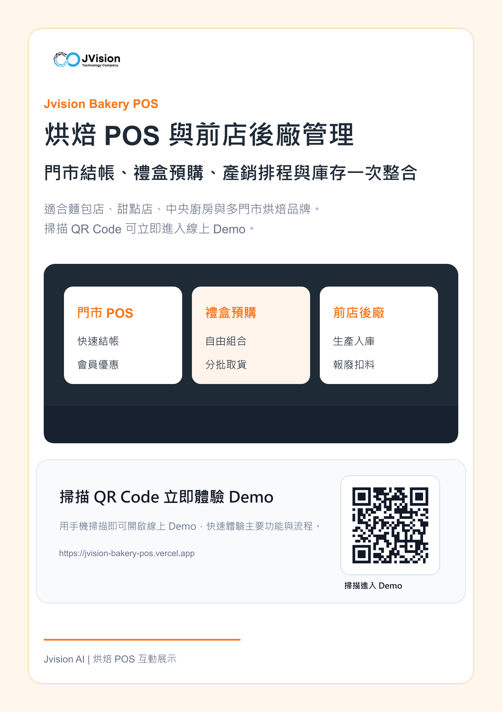

# Jvision 烘焙 POS 與前店後廠管理

可互動展示的烘焙門市與前店後廠管理 Demo，整合門市 POS、禮盒預購、庫存入出、中央廚房生產、報廢扣料與 AI 銷售摘要。

## 線上 Demo

[https://jvision-bakery-pos.vercel.app](https://jvision-bakery-pos.vercel.app)

## 行銷海報



## 檔案

- [海報 PNG](./docs/marketing/jvision-bakery-pos-poster.png)
- [海報 PDF](./docs/marketing/jvision-bakery-pos-poster.pdf)
- [產品介紹 PDF](./docs/marketing/jvision-bakery-pos-product-introduction.pdf)
- [線上海報 PNG](https://jvision-bakery-pos.vercel.app/jvision-bakery-pos-poster.png)
- [線上產品介紹 PDF](https://jvision-bakery-pos.vercel.app/jvision-bakery-pos-product-introduction.pdf)

## Demo 功能

- 新增門市 POS 與禮盒預購訂單
- 建立自由組合禮盒與會員促銷
- 訂單轉生產批次
- 更新庫存、入庫與報廢扣料
- 檢視營收、未收款、低庫存與 AI 營運紀錄

## 指令

```bash
npm install
npm run build
npm run assets
npm run verify
```
