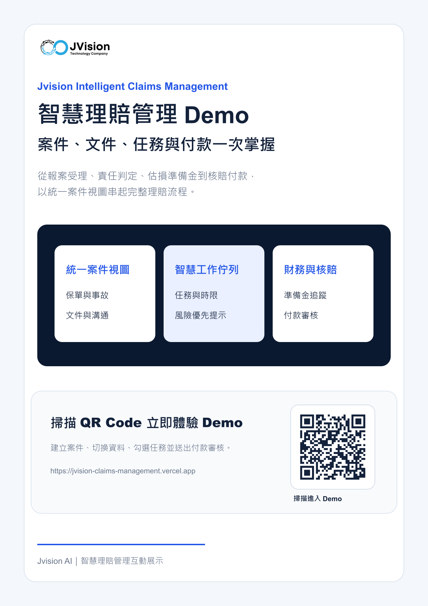

# Jvision 智慧理賠管理

Jvision 智慧理賠管理是一套可直接操作的保險理賠流程 Demo，整合案件、文件、任務、準備金與付款進度，協助理賠團隊在同一個工作介面掌握案件狀態與後續作業。

## 線上 Demo

- 正式網站：[https://jvision-claims-management.vercel.app](https://jvision-claims-management.vercel.app)
- 行銷海報：[線上查看 PNG](https://jvision-claims-management.vercel.app/marketing/jvision-claims-management-poster.png)
- 產品介紹：[線上查看 PDF](https://jvision-claims-management.vercel.app/marketing/jvision-claims-management-product-introduction.pdf)

## 專案海報

[](docs/marketing/jvision-claims-management-poster.png)

## Demo 功能

- 理賠案件列表、搜尋與案件切換
- 案件狀態、風險等級、承辦人與準備金總覽
- 建立新理賠案件並立即加入案件佇列
- 保單與事故、文件、溝通紀錄及財務頁籤切換
- 待辦任務新增、完成狀態切換與追蹤
- 付款審核操作示範
- Jvision 智慧摘要與案件處理建議
- 桌面、平板與手機 RWD 響應式排版

> 本站為產品功能展示用途，畫面中的客戶、案件、金額與事故資料皆為示範資料。

## 操作方式

1. 從左側案件佇列選擇任一案件。
2. 使用搜尋欄依案件編號、客戶或車輛篩選資料。
3. 切換案件頁籤查看不同理賠作業區域。
4. 在待辦任務區新增任務或切換完成狀態。
5. 點選「建立新案件」測試新增案件流程。
6. 點選「送出付款審核」測試財務審核操作。

## 技術架構

- Next.js 16（App Router）
- React 19
- TypeScript
- Tailwind CSS 4
- Vercel Production Deployment

## 本機啟動

需要 Node.js 20 或更新版本。

```bash
npm install
npm run dev
```

開啟 [http://localhost:3000](http://localhost:3000) 即可使用 Demo。

## 品質檢查

```bash
npm run lint
npm run build
```

## 專案用途

此專案用於 Jvision 智慧理賠管理的產品展示、流程驗證與行銷介紹，可作為後續串接保單核心、文件管理、事故影像辨識、工作流程與付款系統的前端原型。

---

Jvision AI｜智慧理賠流程互動展示
