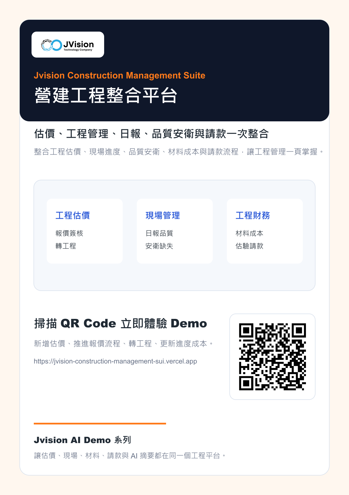

# Jvision 營建工程整合平台

整合工程估價、現場進度、品質安衛、材料成本與請款流程的互動 Demo，讓工程管理一頁掌握。

## 線上 Demo

[https://jvision-construction-management-sui.vercel.app](https://jvision-construction-management-sui.vercel.app)

## 行銷海報

## 檔案

- [海報 PNG](./docs/marketing/jvision-construction-management-suite-poster.png)
- [海報 PDF](./docs/marketing/jvision-construction-management-suite-poster.pdf)
- [產品介紹 PDF](./docs/marketing/jvision-construction-management-suite-product-introduction.pdf)

## Demo 功能

- 新增工程估價
- 推進報價簽核流程
- 核准後轉工程專案
- 更新工程進度與材料成本
- 新增日報、品質、安衛與請款待辦
- 產生 AI 工程摘要
