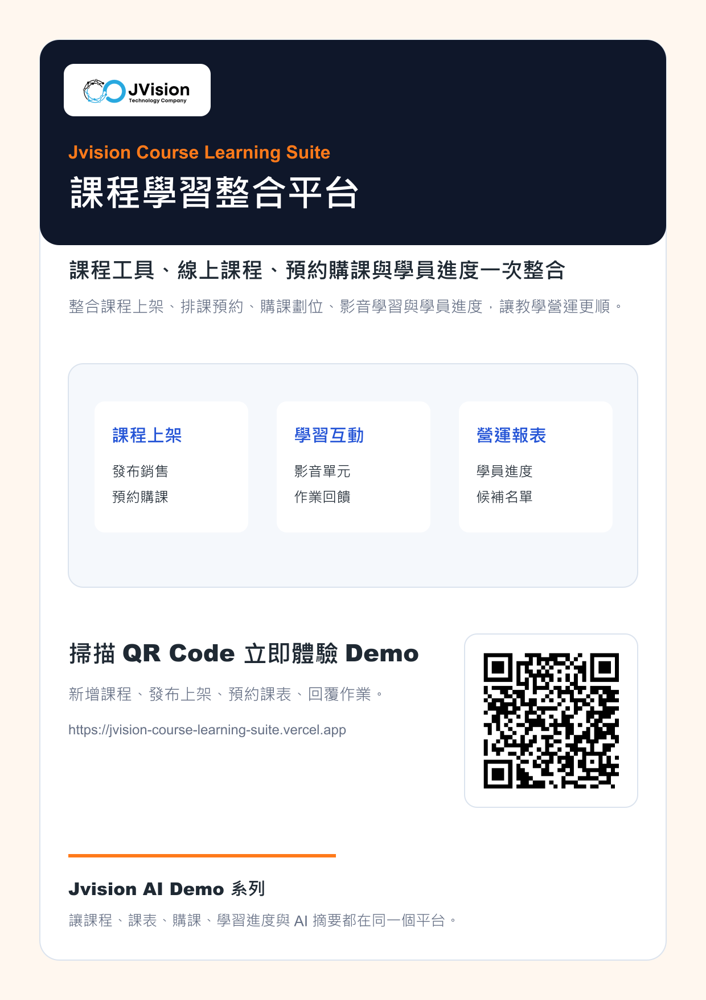

# Jvision 課程學習整合平台

整合「課程工具平台」與「線上課程平台」的互動 Demo。原有展示仍保留，這個專案是新增的合併版本。

## 線上 Demo

[https://jvision-course-learning-suite.vercel.app](https://jvision-course-learning-suite.vercel.app)

## 行銷海報

## 檔案

- [海報 PNG](./docs/marketing/jvision-course-learning-suite-poster.png)
- [海報 PDF](./docs/marketing/jvision-course-learning-suite-poster.pdf)
- [產品介紹 PDF](./docs/marketing/jvision-course-learning-suite-product-introduction.pdf)

## Demo 功能

- 新增課程與發布上架
- 課表預約與候補劃位
- 課程銷售與購課管理
- 影音單元與作業回饋
- 學員進度與營運摘要
