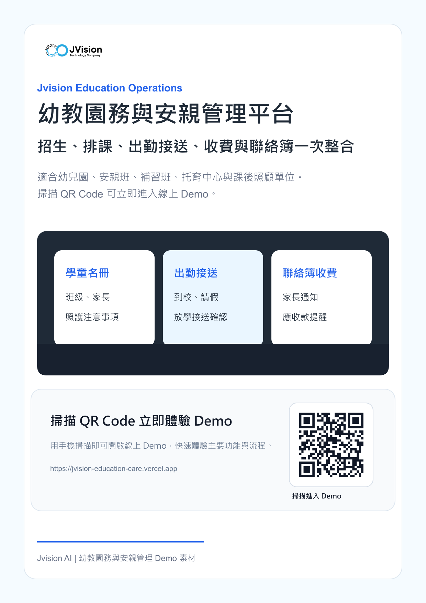

# Jvision 幼教園務與安親管理平台

可互動展示的幼教與安親營運管理 Demo，整合招生 CRM、學童名冊、排課出勤、接送確認、收費提醒、電子聯絡簿與 AI 園務摘要。

## 線上 Demo

[https://jvision-education-care.vercel.app](https://jvision-education-care.vercel.app)

## 行銷海報



## 檔案

- [海報 PNG](./docs/marketing/jvision-education-care-poster.png)
- [海報 PDF](./docs/marketing/jvision-education-care-poster.pdf)
- [產品介紹 PDF](./docs/marketing/jvision-education-care-product-introduction.pdf)

## Demo 功能

- 新增學童與家長資料
- 更新到校、請假與接送狀態
- 建立班級課程與老師教室
- 發送聯絡簿、接送提醒與繳費通知
- 檢視園務 KPI 與 AI 營運摘要

## 指令

```bash
npm install
npm run build
npm run assets
```
