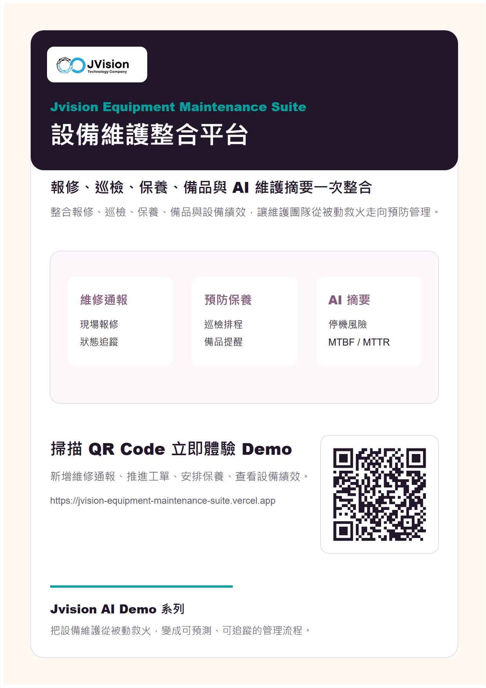

# Jvision 設備維護整合平台

整合「設備維護」與「智慧設備維護與預防保養」的互動 Demo。原有展示仍保留，這個專案是新增的合併版本。

## 線上 Demo

[https://jvision-equipment-maintenance-suite.vercel.app](https://jvision-equipment-maintenance-suite.vercel.app)

## 行銷海報



## 檔案

- [海報 PNG](./docs/marketing/jvision-equipment-maintenance-suite-poster.png)
- [海報 PDF](./docs/marketing/jvision-equipment-maintenance-suite-poster.pdf)
- [產品介紹 PDF](./docs/marketing/jvision-equipment-maintenance-suite-product-introduction.pdf)
- [線上海報 PNG](https://jvision-equipment-maintenance-suite.vercel.app/jvision-equipment-maintenance-suite-poster.png)
- [線上產品介紹 PDF](https://jvision-equipment-maintenance-suite.vercel.app/jvision-equipment-maintenance-suite-product-introduction.pdf)

## Demo 功能

- 新增維修通報
- 推進工單看板
- 建立預防保養提醒
- 查看設備 MTBF / MTTR
- 產生 AI 維護摘要

## 指令

```bash
npm install
npm run build
npm run assets
npm run verify
```
