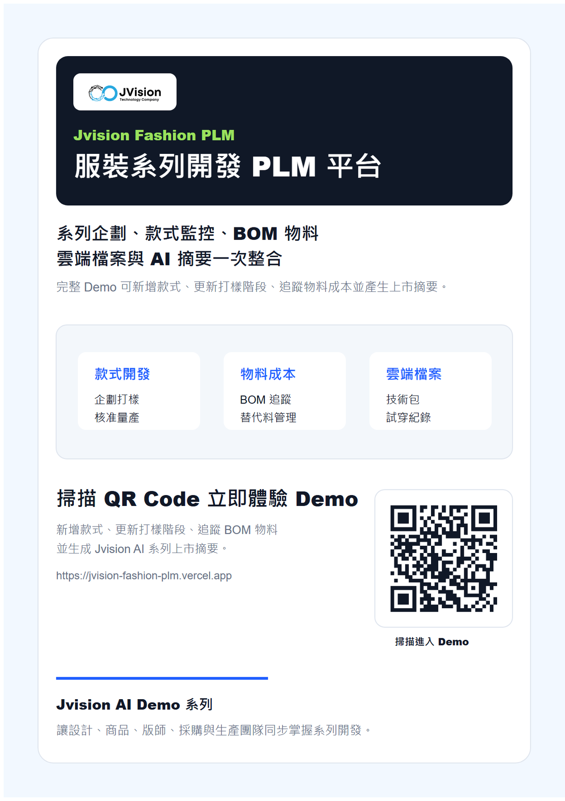

# Jvision 服裝系列開發 PLM 平台

Jvision 服裝系列開發 PLM 平台是一個獨立互動 Demo，將系列企劃、款式監控、BOM 物料、雲端檔案、動態報表與 AI 摘要集中在同一個商品開發工作台。

## 線上 Demo

https://jvision-fashion-plm.vercel.app



## Demo 功能

- 新增服裝款式資料
- 更新企劃、打樣、試穿修正與核准量產階段
- 追蹤 BOM 物料、供應商、成本與替代料狀態
- 上傳技術包與系列開發文件
- 查看跨部門同步紀錄
- 生成 Jvision AI 系列上市摘要

## 指令

```bash
npm install
npm run assets
npm run build
npm run verify
```

## 行銷素材

- `docs/marketing/jvision-fashion-plm-poster.png`
- `docs/marketing/jvision-fashion-plm-poster.pdf`
- `docs/marketing/jvision-fashion-plm-product-introduction.pdf`
