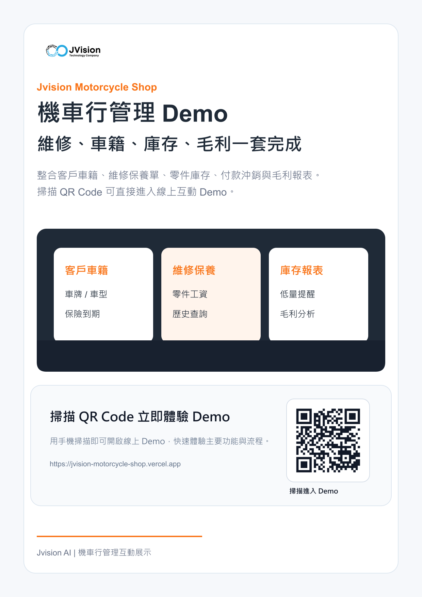

# Jvision 機車行管理 Demo

Jvision 機車行管理平台，展示客戶車籍、維修保養單、零件庫存、付款沖銷、報表列印與毛利分析流程。

## 線上 Demo

- 正式網站：[https://jvision-motorcycle-shop.vercel.app](https://jvision-motorcycle-shop.vercel.app)



## Demo 功能

- 客戶車籍
- 維修保養
- 庫存報表
- 可操作的表單、按鈕、篩選或流程狀態
- 桌面、平板與手機 RWD 響應式排版

> 本站為產品功能展示用途，畫面中的人物、公司、金額與營運資料皆為示範資料。

## 操作方式

1. 開啟線上 Demo，先查看儀表板與營運摘要。
2. 依照頁面導覽切換主要功能區。
3. 操作新增、編輯、篩選、狀態切換或流程按鈕。
4. 使用不同螢幕尺寸檢視 RWD 操作介面。

## 技術架構

- Next.js
- React
- TypeScript
- Vercel Production Deployment

## 本機啟動

需要 Node.js 20 或更新版本。

```bash
npm install
npm run dev
```

開啟 [http://localhost:3000](http://localhost:3000) 即可使用 Demo。

## 品質檢查

```bash
npm run build
```

## 行銷素材

- [行銷海報 PNG](docs/marketing/jvision-motorcycle-shop-poster.png)
- [行銷海報 PDF](docs/marketing/jvision-motorcycle-shop-poster.pdf)
- [產品介紹 PDF](docs/marketing/jvision-motorcycle-shop-product-introduction.pdf)

---

Jvision AI｜Jvision 機車行管理互動展示
