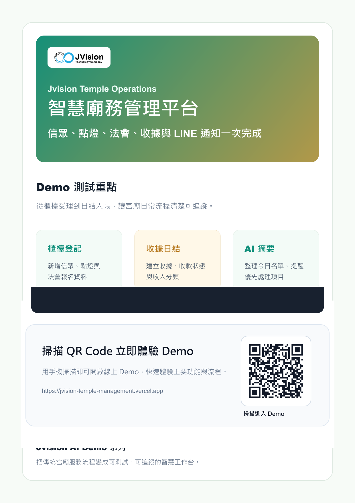

# Jvision 智慧廟務管理平台




可互動展示的宮廟營運 Demo，整合信眾資料、點燈牌位、法會報名、捐款收據、日結入帳、LINE 通知文案與 AI 摘要。

## 線上 Demo

https://jvision-temple-management.vercel.app

## Demo 功能

- 櫃檯快速建立信眾登記
- 點燈項目與法會活動選擇
- 收據開立與日結入帳測試
- LINE 通知文案產生
- 信眾名冊與 AI 廟務摘要

## 指令

```bash
npm install
npm run build
npm run assets
```
