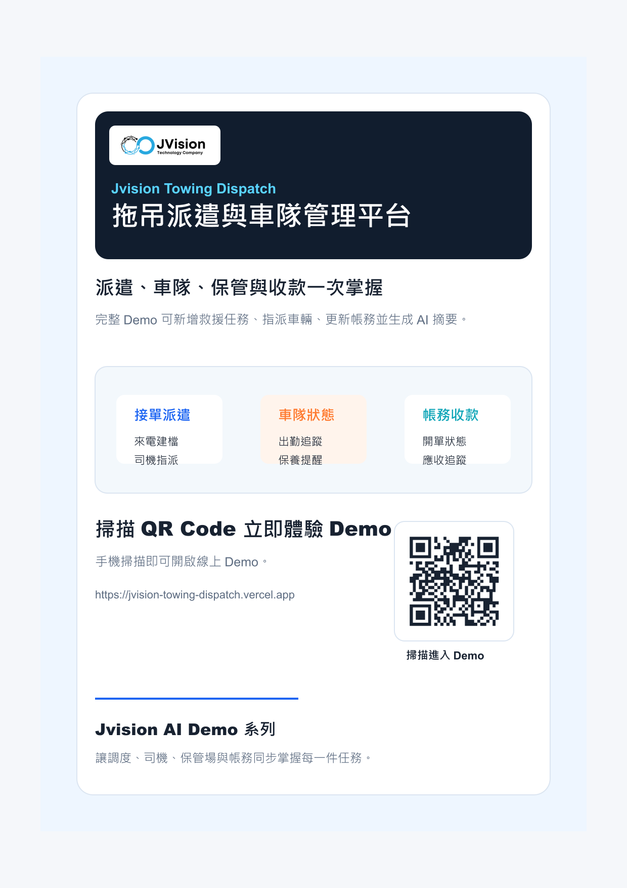

# Jvision 拖吊派遣與車隊管理平台

可互動展示的拖吊派遣 Demo，整合來電接案、道路救援派遣、司機任務、車隊狀態、扣車管理、帳務收款與 AI 營運摘要。

## 線上 Demo

https://jvision-towing-dispatch.vercel.app

## 專案海報

[](docs/marketing/jvision-towing-dispatch-poster.png)

## Demo 功能

- 新增道路救援與拖吊任務
- 指派最近車輛與司機
- 依流程推進派遣狀態
- 查看車隊狀態與帳務收款
- 生成 AI 派遣營運摘要

## 指令

```bash
npm install
npm run build
npm run assets
npm run verify
```

## 行銷素材

- `docs/marketing/jvision-towing-dispatch-poster.png`
- `docs/marketing/jvision-towing-dispatch-poster.pdf`
- `docs/marketing/jvision-towing-dispatch-product-introduction.pdf`
