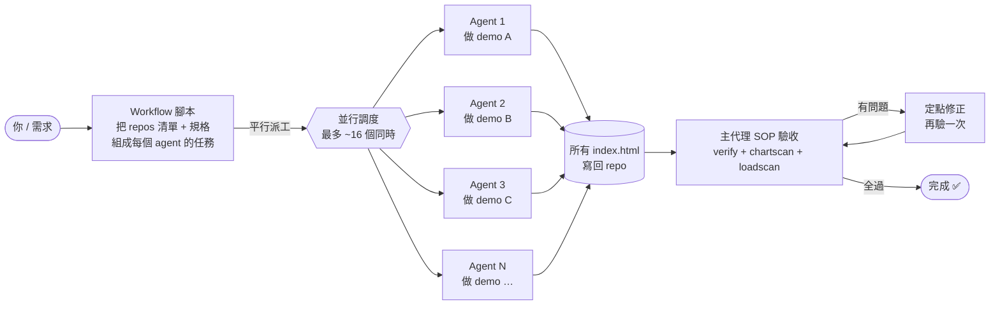
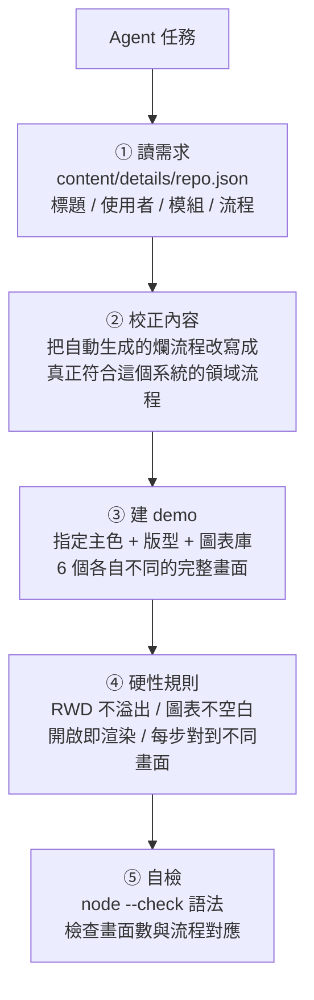
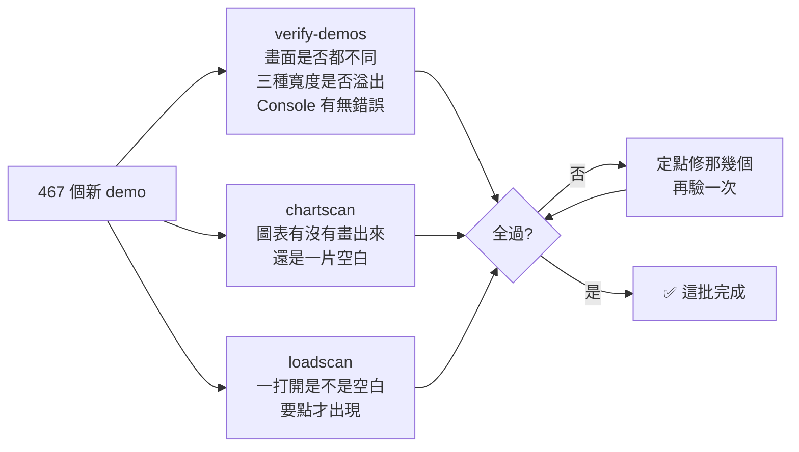
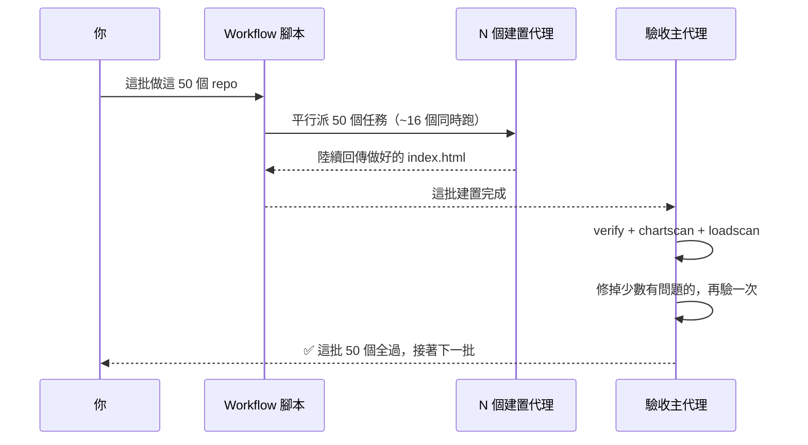
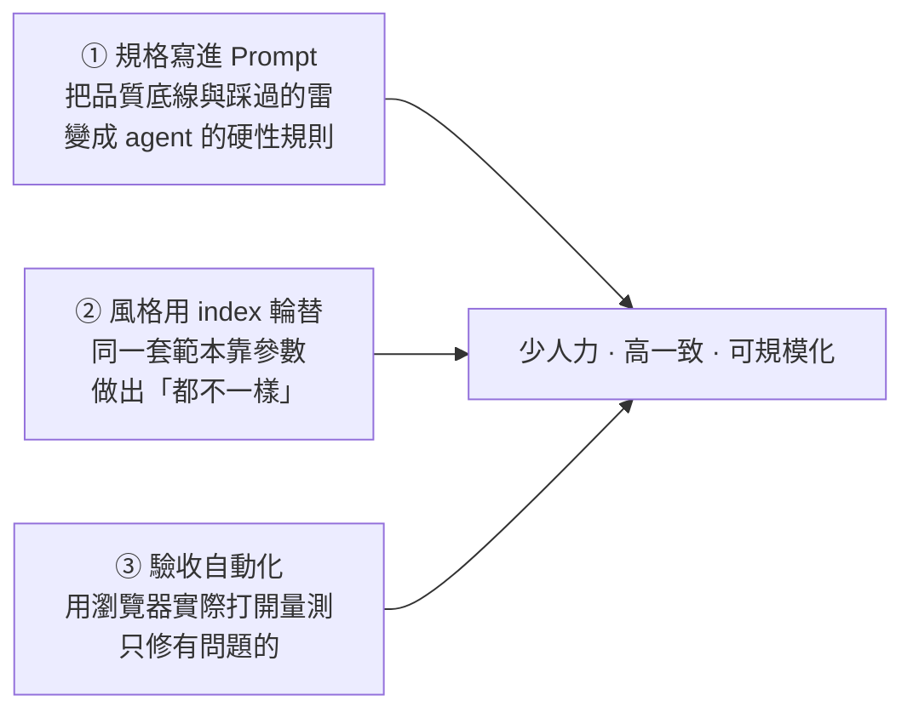

# 多代理（Multi-Agent）量產 Demo 網站流程

> 一句話：**一支腳本把工作切成 N 份 → 同時派給 N 個 AI 代理各做一個網站 → 主代理統一驗收、修錯**。
> 用這套流程，464 個各自獨立的 demo 網站可以「一批 50~67 個、約 16 個同時進行」地產出並驗證。

---

## 1. 整體架構



**三個角色**

| 角色 | 是誰 | 做什麼 |
|---|---|---|
| **派工腳本** | Workflow 腳本 | 拿一份 repos 清單，替每個 repo 產生「任務指令」，一次平行送出 |
| **建置代理** | N 個 sub-agent | 各自認領一個網站，讀需求 → 蓋出一頁式 bespoke demo → 自檢 |
| **驗收代理** | 主代理（大 agent） | 全部做完後統一跑檢查工具，抓錯、定點修 |

---

## 2. 派工示意（Fan-out）

<div style="font-family:system-ui,'Noto Sans TC',sans-serif;border:1px solid #dbe6f0;border-radius:14px;padding:18px;background:#f7fafc;max-width:720px">
  <div style="display:flex;align-items:center;gap:10px;margin-bottom:14px">
    <div style="background:#0369a1;color:#fff;font-weight:700;padding:10px 14px;border-radius:10px">📋 Workflow 腳本</div>
    <div style="color:#5b708a;font-size:13px">把 50 個 repo 切成 50 個任務</div>
  </div>
  <div style="border-left:3px dashed #94a3b8;margin-left:22px;padding-left:20px;display:flex;flex-direction:column;gap:8px">
    <div style="display:flex;gap:8px;flex-wrap:wrap">
      <div style="background:#fff;border:1px solid #dbe6f0;border-radius:9px;padding:8px 12px;font-size:12.5px">🤖 Agent 1 → <b>財務報表系統</b></div>
      <div style="background:#fff;border:1px solid #dbe6f0;border-radius:9px;padding:8px 12px;font-size:12.5px">🤖 Agent 2 → <b>關稅稅務系統</b></div>
      <div style="background:#fff;border:1px solid #dbe6f0;border-radius:9px;padding:8px 12px;font-size:12.5px">🤖 Agent 3 → <b>IAM 權限系統</b></div>
    </div>
    <div style="display:flex;gap:8px;flex-wrap:wrap">
      <div style="background:#fff;border:1px solid #dbe6f0;border-radius:9px;padding:8px 12px;font-size:12.5px">🤖 Agent 4 → <b>庫存管理系統</b></div>
      <div style="background:#fff;border:1px solid #dbe6f0;border-radius:9px;padding:8px 12px;font-size:12.5px">🤖 …（同時進行）</div>
      <div style="background:#eef6fb;border:1px dashed #7fb2d6;border-radius:9px;padding:8px 12px;font-size:12.5px;color:#0369a1">🤖 Agent 50</div>
    </div>
  </div>
  <div style="margin:14px 0 0 22px;color:#0d9488;font-weight:700;font-size:13px">↓ 每個 agent 只專心做「自己那一個」，彼此不互相干擾</div>
  <div style="margin-top:10px;background:#0d9488;color:#fff;padding:10px 14px;border-radius:10px;display:inline-block;font-weight:700">🔍 主代理：全部收回來，統一驗收</div>
</div>

> **為什麼快**：50 個網站不是「一個做完再做下一個」，而是同時有 ~16 個在進行，做完一個就補下一個進來，直到 50 個都完成。

---

## 3. 每個建置代理收到的「任務指令」重點

每個 agent 拿到的是同一套規格範本，只換掉「負責哪個 repo」。指令包含：



**指令裡「寫死的品質底線」**（把過去踩過的雷提前擋掉）：
- 每個系統 **主色、版型、招牌畫面都不同**（不做公版）
- 6 個模組 = 6 個**不一樣的完整畫面**，流程每一步都對到**不同**畫面
- **手機 390px 不能跑版**、圖表不能空白、**打開就要有畫面**（不是點了才出現）
- **不准用計時器**自動更新資料（會害畫面跳掉）
- 圖表庫輪流用 **ECharts / Chart.js / ApexCharts**，增加多樣性

---

## 4. 驗收 SOP（主代理做）

全部建完後，主代理跑三支自動檢查工具，各抓一種「肉眼難發現」的問題：



<div style="font-family:system-ui,'Noto Sans TC',sans-serif;display:flex;gap:10px;flex-wrap:wrap;margin-top:6px">
  <div style="flex:1 1 180px;border:1px solid #dbe6f0;border-radius:12px;padding:12px;background:#fff">
    <div style="font-weight:700;color:#0369a1">🔍 verify-demos</div>
    <div style="font-size:12.5px;color:#5b708a;margin-top:4px">畫面是否重複、版面有沒有跑版、有沒有程式錯誤</div>
  </div>
  <div style="flex:1 1 180px;border:1px solid #dbe6f0;border-radius:12px;padding:12px;background:#fff">
    <div style="font-weight:700;color:#7c3aed">📊 chartscan</div>
    <div style="font-size:12.5px;color:#5b708a;margin-top:4px">圖表是真的畫出來，還是空白一片</div>
  </div>
  <div style="flex:1 1 180px;border:1px solid #dbe6f0;border-radius:12px;padding:12px;background:#fff">
    <div style="font-weight:700;color:#0d9488">👁 loadscan</div>
    <div style="font-size:12.5px;color:#5b708a;margin-top:4px">一打開就有內容，不是點了才出現</div>
  </div>
</div>

> 這三支都用無頭瀏覽器（Playwright）真的把網頁打開、量尺寸、看圖表，所以能抓到「人工一個個點很難發現」的問題。

---

## 5. 一批的完整節奏



---

## 6. 重點回顧

1. **切工作**：一支腳本把「大量、規格一致但內容各異」的工作，拆成一份份獨立任務。
2. **平行做**：多個 AI 代理同時各做一份，做完就補下一份，速度是單線的十幾倍。
3. **統一驗**：主代理用自動化工具批次驗收，只在少數出問題的地方定點修 —— 品質底線寫進指令裡，錯誤提前擋掉。

> 適用情境：**數量多、每個都要客製、但有共同品質標準**的產出（網站、報告、頁面、資料轉換…）都能套這個「派工 → 平行 → 驗收」的三段式流程。

---

## 7. 學習用 Prompt（照著做就能生一套自己的）

> 這一節給想「自己做出這套工具」的人。準備一個支援 **多代理 / Workflow** 的 AI 開發助手（例如 Claude Code），把下面的 Prompt 貼進去、改成你的題目即可。

### 7-1 給 AI 的「打造工具」Prompt

> 用途：讓 AI 幫你把「派工 → 平行 → 驗收」這套流程建起來。**把 `【】` 內換成你的情境**。

```text
我要量產【一批性質相同但內容各異的產出，例如：50 個不同主題的一頁式介紹網站】。
請幫我用「多代理平行 + 主代理驗收」的方式完成，分三部分交付：

一、派工腳本（Workflow）
- 輸入是一份清單：repos = [【項目1】, 【項目2】, …]（每個項目對應一個要產出的東西）。
- 對清單「平行」派工，最多同時 ~16 個，做完一個補下一個。
- 每個項目丟給一個 sub-agent，agent 的任務用一個 buildPrompt(item, index) 函式產生。
- 用 index 輪流指派「不同的風格參數」（主色、版型、圖表庫），確保每個產出長得不一樣。
- 全部結束後回報：成功幾個 / 失敗幾個。

二、每個 agent 的建置任務（buildPrompt 內容）
- 先讀該項目的需求資料（檔案或說明），理解它真正要呈現什麼。
- 依指派的風格參數，做出一個「自成一體、可直接開啟」的成品。
- 把我的「硬性品質規則」寫進 prompt（見下方 7-2），要求 agent 產出前先自檢。

三、驗收工具（主代理跑）
- 寫 2~3 支自動檢查腳本（用無頭瀏覽器 Playwright 實際打開產出）：
  1) 版面檢查：不同寬度（如 390 / 768 / 1360px）不可有水平溢出、內容不可重複、Console 不可有錯。
  2) 內容檢查：該有的元素（圖表 / 區塊）真的有渲染，不是空白。
  3) 首屏檢查：一打開就有內容，不是要互動才出現。
- 檢查報告只印「有問題的」，我再針對那幾個定點修、重驗。

請先給我整體架構與檔案清單，再逐步實作。
```

### 7-2 每個建置代理的「任務範本」Prompt

> 用途：這是 `buildPrompt(item, index)` 真正吐給每個 sub-agent 的內容。**重點是把踩過的雷寫成「硬性規則」，讓錯誤在生成當下就被擋掉**。

```text
你要做「一個」成品：【item 的名稱／需求檔路徑】。

步驟：
1. 讀需求：【需求來源，例如 content/details/<item>.json】，理解標題、使用者、要有的模組與流程。
2. 若既有的流程/模組是自動生成的爛內容，先改寫成真正符合這個主題的版本。
3. 依指派風格做成品：主色 = 【index 對應的顏色】、版型 = 【index 對應的版型】、圖表庫 = 【ECharts / Chart.js / ApexCharts 輪流】。
4. 產出「6 個各自不同的完整畫面」，每個畫面填滿擬真假資料，不可看起來空。

硬性規則（每一條都要遵守，違反會被驗收退回）：
- 自成一體：單一 HTML，內嵌 CSS/JS，不依賴後端。
- RWD：390 / 768 / 1360px 都不可有水平溢出；多欄版面要用 CSS class + @media 收合，不要寫死 inline 欄寬。
- 圖表只在該畫面顯示時初始化，且容器已有寬度才畫（避免空白 / NaN）。
- 一打開就要顯示第一個畫面（不是點了才出現）；畫面切換用網址 hash（#go=N）深連結。
- 每個流程步驟要對到「不同」畫面，絕不可兩步共用同一畫面。
- 不准用 setInterval / setTimeout 自動更新資料（會害畫面跳掉）；動態感只用 CSS 動畫。
- 命名不要用 top / name / location / status 等會和瀏覽器全域衝突的字。
- 產出前先做語法檢查（node --check），零錯誤才算完成。

完成後回報：6 個畫面各是什麼、流程每步對到哪個畫面（確認全不同）、用了哪個圖表庫。
```

### 7-3 三個心法（工具能成立的關鍵）



> 一句話總結：**「範本 + 參數輪替」負責量與多樣性，「Prompt 內的硬規則 + 自動驗收」負責品質**，兩者合起來就能穩定地大量產出。
